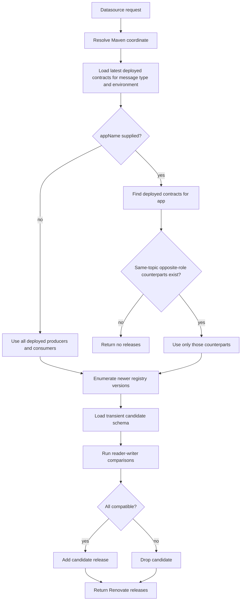

# Compatibility-Aware Renovate

This production endpoint provides an isolated, fail-closed Renovate compatibility flow. It does not change the existing
deployment compatibility endpoint.

## API Flow

Applications continue to upload contracts and register deployments with the existing APIs:

```http
PUT /api/contracts/{appName}/{appVersion}
PUT /api/deployments/{appName}/{appVersion}/{environment}
```

Renovate queries the read-only datasource endpoint:

```http
GET /api/renovate/message-types/{packageName}
```

| Parameter | Required | Description |
| --- | --- | --- |
| `currentValue` | yes | Current Maven dependency version found by Renovate. |
| `appName` | no | Selects app-specific mode. Omit it for global mode. A present blank value is invalid. |
| `environment` | no | Nonblank deployment environment, default `PROD`. Other environments are supported. |

`appVersion` is never request input. MCS uses it only internally to join each latest deployment to the contracts
uploaded for that deployed application version.

### Global mode

With no `appName`, MCS loads all latest deployed contracts in the requested environment for the message type. For each newer candidate:

- the candidate is the reader against every deployed producer;
- every deployed consumer is the reader against the candidate as writer.

The candidate is returned only if every comparison succeeds.

```bash
curl --fail --user "$MCS_RENOVATE_USER:$MCS_RENOVATE_PASSWORD" --get \
  'https://internal-csp.applicationplatform.nivel.bazg.admin.ch/message-contract-service/api/renovate/message-types/ch.admin.bit.jeap.jme.messagetype.jme:jme-create-declaration-command' \
  --data-urlencode 'currentValue=1.0.0' \
  --data-urlencode 'environment=PROD'
```

### App-specific mode

With `appName`, MCS finds that application's currently deployed contracts for the message type. Their role and
topic determine the comparison set. For each requesting contract, MCS compares the candidate only with deployed
contracts in the requested environment on the same topic and with the opposite role:

- requesting consumer: candidate reader versus deployed producer writers;
- requesting producer: deployed consumer readers versus candidate writer.

An unknown or not-currently-deployed application, or a requesting contract without a same-topic opposite-role
counterpart, fails closed.

```bash
curl --fail --user "$MCS_RENOVATE_USER:$MCS_RENOVATE_PASSWORD" --get \
  'https://internal-csp.applicationplatform.nivel.bazg.admin.ch/message-contract-service/api/renovate/message-types/ch.admin.bit.jeap.jme.messagetype.jme:jme-create-declaration-command' \
  --data-urlencode 'currentValue=1.0.0' \
  --data-urlencode 'appName=my-application' \
  --data-urlencode 'environment=PROD'
```

Both modes return Renovate's custom datasource format:

```json
{
  "releases": [
    { "version": "1.1.0" }
  ]
}
```

An empty `releases` array means that no update could be proven safe. This includes no deployed contracts in the requested environment,
an unknown app in app-specific mode, no same-topic opposite-role counterpart, a missing or ambiguous registry
source, a missing schema or descriptor, and Avro incompatibility.

## Candidate Selection

MCS resolves the Maven coordinate to a message type, uses the deployed contracts to identify one unambiguous
registry URL and branch, and resolves that branch to one full Git commit. Version enumeration and every candidate
schema load use that immutable snapshot. It creates a transient contract for each semantic version newer than
`currentValue`. Uploaded application versions are not ordered or used as a baseline.



## Renovate Configuration

Two opt-in presets are available. Extend one after the JEAP default preset so its `enabled: true` rule supersedes
the blanket message dependency ignore rule.

Compatibility for one application's deployed role and topic (recommended):

```json
{
  "extends": [
    "github>jeap-admin-ch/jeap-renovate-presets//presets/default",
    "github>jeap-admin-ch/jeap-renovate-presets//presets/compatibility-aware-kafka-message-deps-app-specific(my-application)"
  ]
}
```

Global compatibility across all deployed producers and consumers (explicit fallback):

```json
{
  "extends": [
    "github>jeap-admin-ch/jeap-renovate-presets//presets/default",
    "github>jeap-admin-ch/jeap-renovate-presets//presets/compatibility-aware-kafka-message-deps"
  ]
}
```

Both presets define `custom.jeap-message-contracts` and the Maven routing rule. Teams normally pass only their
`appName` to the recommended preset and do not override the centrally configured datasource. Configure a dedicated read-only user under
`jeap.messagecontract.users.read-users` and supply its credentials centrally in the self-hosted Renovate runner's
`hostRules`; do not commit credentials to presets or application repositories. Read users can query compatibility
endpoints but cannot upload contracts or change deployments.

## Failure Handling and Operations

- Expected incompatibility, missing app/counterpart, and malformed candidate outcomes return HTTP `200` with an empty `releases` array.
- Invalid coordinates, versions, application parameters, and environments return HTTP `400`.
- Authentication and authorization failures return HTTP `401` and `403` respectively.
- Registry clone, checkout, and version-enumeration infrastructure failures return HTTP `503`.
- The endpoint does not add a compatibility-result cache. Every request reflects the latest deployment joins available
  to MCS.
- Summary logs identify global or app-specific mode, application when supplied, package, current version,
  environment, deployed-contract count, candidate count, and compatible count. Fail-closed paths log a reason
  category; tokens and contract payloads are not logged.

## Local Verification

Run the strict compatibility integration test:

```bash
./mvnw -pl jeap-message-contract-domain -am \
  -Dtest=RenovateCompatibilityServiceTest \
  -Dsurefire.failIfNoSpecifiedTests=false test
```

Run the Renovate routing verification from `jeap-renovate-presets`:

```bash
./tests/renovate-compatibility-test.sh
```
